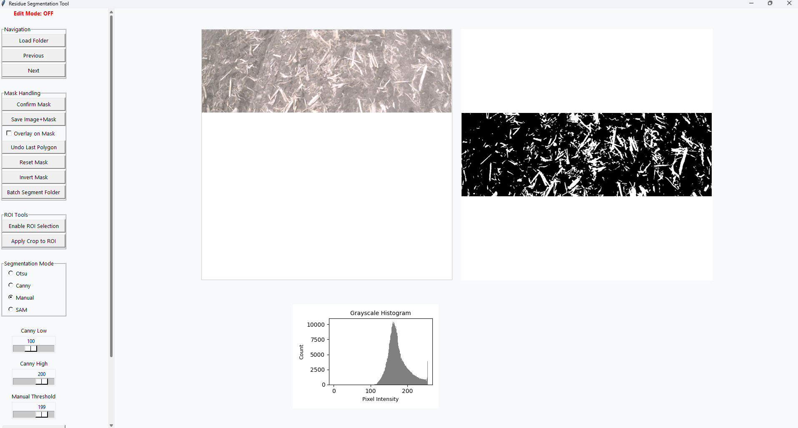

# 🌾 Residue Segmentation Tool (with Segment Anything Model support)

This tool allows users to interactively segment crop residue in images using traditional (Otsu, Canny, Manual) and deep learning-based (SAM) approaches. The tool works offline via a standalone `.exe` application and does **not require Python**.

---

## 🔧 How to Use

### 1. Download the App
- Click on `residue_segment_tool.exe` in the repository.
- Download the file to your computer.
- Run it by double-clicking — no installation or Python required.

> **Note:** Windows might warn you about unknown publishers. Click "More Info" → "Run Anyway".

---

### 2. App Features
- Load folders of images
- Segment with:
  - Otsu threshold
  - Canny edge detector
  - Manual threshold slider
  - SAM (Segment Anything Model)
- Edit masks with polygon & brush
- Invert foreground/background before saving
- Save images and masks to disk
- Batch process entire folders

---

### 3. Quick Demo (Video)
Watch this video to see how the tool works:  
🎥 [`demo_video.mp4`](demo_video.mp4)

---

## 📁 File Outputs
- Saved images go to: `images/`
- Saved masks go to: `masks/`
- You can use these for model training, annotation, or further processing.

---

## 🧠 Segment Anything Model (SAM)
This tool includes a bundled version of Meta's SAM model (ViT-B). No additional downloads required.

---

## ⚠️ Disclaimer
- This is a research tool intended for internal use.
- Performance may vary based on image quality and system specs.

---

## 🔒 Repository Access
This repo is currently private. Contact the maintainer for access or permissions.

---

## 👩‍💻 Maintainer
Sagar Regmi 

University of Illinois Urbana-Champaign  
Email: [sagarr2@illinois.edu]
