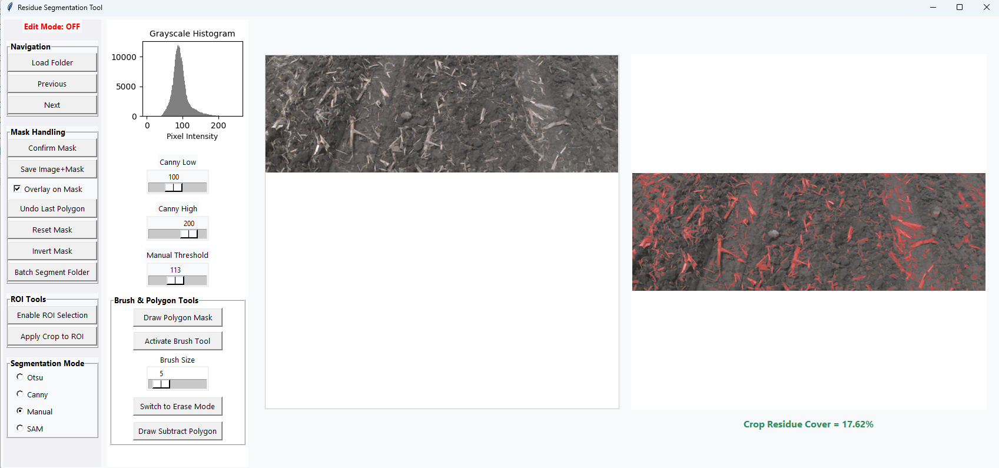

# 🌾 Residue Segmentation Tool (with Segment Anything Model support)

This tool allows users to interactively segment crop residue in images using traditional (Otsu, Canny, Manual) and deep learning-based (SAM) approaches. The tool works offline via a standalone `.exe` application and does **not require Python**.
This tool will be helpful for annotating crop residue images using traditional methods (Otsu, Canny) and deep learning (Segment Anything Model - SAM), and manual edits as well. Built for easy data labeling, visualization, and dataset creation for machine learning applications in agricultural residue cover analysis.

---

**Download the full .exe bundle**  
🔗 [File Link Here](https://zenodo.org/records/15748768)

📁 Extract the ZIP to a **short path**, e.g., `C:\ResidueTool\`  
⚠️ Use [7-Zip](https://www.7-zip.org/) if the default extractor fails.

Double-click `ResidueSegmentationTool.exe` to launch.

---

### 2. App Features
- Load folders of images
- Segment with:
  - Otsu threshold
  - Canny edge detector
  - Manual threshold slider
  - SAM (Segment Anything Model)
- Edit masks with polygon & brush
- Invert foreground/background before saving
- Save images and masks to disk
- Batch process entire folders

---

### 3. Quick Demo (Video)
Watch this video to see how the tool works:  
🎥 [`demo_video.mp4`](https://zenodo.org/records/15748794)

---

## 📁 File Outputs
- Saved images go to: `images/`
- Saved masks go to: `masks/`
- You can use these for model training, annotation, or further processing.

---

## 🧠 Segment Anything Model (SAM)
This tool includes a bundled version of Meta's SAM model (ViT-B). No additional downloads required.

---

## ⚠️ Disclaimer
- This is a research tool intended for internal use.
- Performance may vary based on image quality and system specs.

---

## 🔒 Repository Access
This repo is currently private. Contact the maintainer for access or permissions.

---

## 👩‍💻 Maintainer
Sagar Regmi 

University of Illinois Urbana-Champaign  
Email: [sagarr2@illinois.edu]
